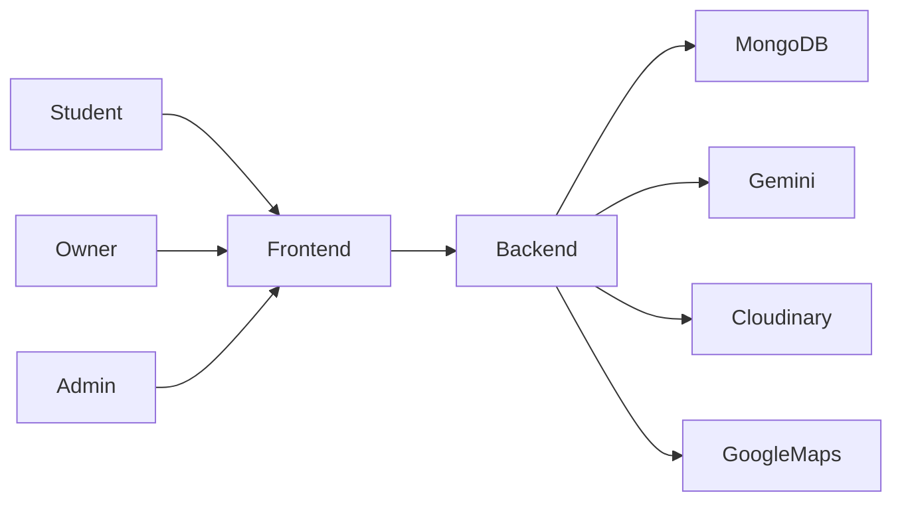

# RentMate

[](http://makeapullrequest.com)
[]()

## 1. Project Introduction

**RentMate** is a smart, student-centric accommodation discovery platform. 

**Problem Statement:** Students relocating for education face significant difficulties finding affordable, safe, and reliable accommodation. Current methods heavily rely on unverified social media groups, local brokers, and word-of-mouth. This leads to issues such as fraudulent listings, hidden charges, poor roommate matching, lack of identity verification, and time-consuming manual searches.

**Solution Overview:** RentMate provides a centralized, trustworthy ecosystem that bridges the gap between students seeking safe housing and property owners looking to rent out their spaces. The platform replaces fragmented social media channels with verified listings, structured communication, and data-driven roommate matching.

**Project Goals:**
- Improve transparency in student accommodation.
- Reduce dependency on brokers and unverified third parties.
- Digitize and improve roommate matching using AI.
- Centralize student housing information and expense tracking.
- Improve the overall renting experience.

## System Overview



---

## Team Information

**Team FantasticFour** - *Gryork TechPreneur Training Program*

| Name              | Role                                          | TECH ID |
| ----------------- | --------------------------------------------- | ------- |
| Priyanshu Singh   | Frontend Development & UI/UX                  | C15E1A  |
| Alokit Mishra     | Backend Development                           | C15E2E  |
| Sunny Kumar Gupta | Database & API Development                    | 57548E  |
| Prakhar Pandey    | Project Coordination, Testing & Documentation | BEC1DA  |

---

## 2. Feature Overview

### Implemented Features (MVP)
- **Smart Accommodation Search:** Filter properties by city, college name, budget, property type, and sharing type.
- **Verified Property Listings:** Admin-verified listings displaying owner details, rent, amenities, and location via interactive Google Maps embeddings.
- **AI-Powered Roommate Matching:** Data-driven compatibility scoring using Google Gemini 2.0 Flash based on sleep schedule, study hours, food preferences, cleanliness, and noise tolerance.
- **Expense Splitter:** Built-in tool to track shared household expenses, calculate per-person shares, and view outstanding balances.
- **Wishlist & Inquiries:** Save favorite properties and send direct inquiries to property owners.
- **Reviews & Ratings:** Submit and view ratings for food quality, safety, internet, and cleanliness (restricted to verified students).
- **Role-based Dashboards:** Dedicated and secure interfaces for Students, Property Owners, and Admins.

### Future Work
- **Real-Time Engine:** Push notifications and live chat using WebSockets (Socket.io).
- **Mobile Applications:** Native Android and iOS apps using React Native.
- **Online Payments:** Integration with payment gateways (Stripe, UPI) for deposits and rent.
- **Automated Verification:** KYC integration for automated identity and property document verification.

---

## 3. Technology Stack

- **Frontend:** React 19, Vite, Tailwind CSS v4, React Router v7, Context API.
- **Backend:** Node.js, Express.js.
- **Database:** MongoDB (Atlas), Mongoose ODM.
- **Authentication & Security:** JSON Web Tokens (JWT), bcryptjs, Helmet.
- **File Storage:** Cloudinary (via Multer memory storage).
- **AI Integration:** Google Generative AI (Gemini 2.0 Flash) for Roommate Matching.
- **External Services:** Google Maps Embed API.

---

## 4. Project Structure

RentMate is built as a monorepo containing both the frontend and backend applications:

```text
RentMate/
├── backend/                  # Node.js/Express REST API
│   ├── src/
│   │   ├── config/           # Database and environment configurations
│   │   ├── controllers/      # Route logic and handlers
│   │   ├── middleware/       # Custom middlewares (JWT auth, role validation)
│   │   ├── models/           # Mongoose schemas
│   │   ├── routes/           # Express route definitions
│   │   └── services/         # Third-party integrations (Gemini, Cloudinary)
│   └── server.js             # API entry point
├── frontend/                 # React.js SPA (Vite)
│   ├── src/
│   │   ├── api/              # Axios configuration and API wrappers
│   │   ├── components/       # Reusable UI components (Navbar, ProtectedRoute)
│   │   ├── context/          # React Context providers (AuthContext)
│   │   ├── pages/            # View-level components mapped to routes
│   │   └── App.jsx           # Main routing configuration
│   └── vite.config.js        # Vite bundler configuration
└── docs/                     # Comprehensive project documentation suite
```

---

## 5. Installation Guide

### Prerequisites
- Node.js (v18+ recommended)
- MongoDB running locally or a MongoDB Atlas URI
- Cloudinary Account (for image uploads)
- Google Gemini API Key (for AI roommate matching)

### Clone the Repository
```bash
git clone https://github.com/vknow360/RentMate.git
cd RentMate
```

### Backend Setup
```bash
cd backend
npm install

# Create a .env file based on the template
cp .env.example .env
# Edit .env with your MongoDB URI, JWT Secret, Cloudinary credentials, and Gemini API key

# Run the backend development server
npm run dev
```

### Frontend Setup
Open a new terminal window:
```bash
cd frontend
npm install

# Create a .env file based on the template
cp .env.example .env
# Ensure VITE_API_BASE_URL is set correctly (e.g., http://localhost:5000/api)

# Run the frontend development server
npm run dev
```

### Admin Setup (Optional)
To bootstrap the initial admin user, run the following command in the `backend` directory:
```bash
node src/scripts/seedAdmin.js
```
*Default Admin Credentials:* `admin@rentmate.com` / `adminpassword123`

The application should now be accessible at `http://localhost:5173`.

---

## 6. Deployment

The application MVP is optimized for deployment on lightweight Platform-as-a-Service (PaaS) providers:
- **Frontend Deployment:** Vercel (Auto-deployments from GitHub).
- **Backend Deployment:** Render (Free Web Service).
- **Database:** MongoDB Atlas (M0 Shared Cluster).
- **Media Storage:** Cloudinary (Free Tier).

*For detailed deployment instructions, including environment variable configurations, refer to the [Deployment Guide](docs/09_DEPLOYMENT_GUIDE.md).*

---

## 7. Documentation

The `/docs` directory contains the complete technical documentation suite for RentMate.

| Document | Description |
| --- | --- |
| [Project Overview](docs/01_PROJECT_OVERVIEW.md) | High-level vision, problem statement, and project scope. |
| [System Architecture](docs/02_SYSTEM_ARCHITECTURE.md) | 3-Tier architecture overview and infrastructure diagrams. |
| [Frontend Architecture](docs/03_FRONTEND_ARCHITECTURE.md) | React/Vite client structure, routing, and design philosophy. |
| [Backend Architecture](docs/04_BACKEND_ARCHITECTURE.md) | Node/Express server setup, controllers, and services. |
| [Database Design](docs/05_DATABASE_DESIGN.md) | MongoDB schemas, indexes, and Entity-Relationship (ER) diagrams. |
| [API Documentation](docs/06_API_DOCUMENTATION.md) | REST API endpoints, request/response formats, and categories. |
| [Authentication & Security](docs/07_AUTHENTICATION_AND_SECURITY.md) | JWT flow, Role-Based Access Control (RBAC), and data protection. |
| [AI Matching Engine](docs/08_AI_MATCHING_ENGINE.md) | Details on the Gemini AI integration and fallback algorithms. |
| [Deployment Guide](docs/09_DEPLOYMENT_GUIDE.md) | Instructions for deploying on Vercel, Render, and MongoDB Atlas. |
| [Testing Strategy](docs/10_TESTING_STRATEGY.md) | Overview of unit, API, and E2E testing approaches. |
| [Performance & Optimization](docs/11_PERFORMANCE_AND_OPTIMIZATION.md) | Database indexing, AI caching, and frontend optimizations. |
| [Known Limitations](docs/12_KNOWN_LIMITATIONS.md) | Documented constraints of the MVP implementation. |
| [Future Roadmap](docs/13_FUTURE_ROADMAP.md) | Planned features for subsequent development phases. |
| [Development Workflow](docs/14_DEVELOPMENT_WORKFLOW.md) | Local environment setup and coding standards. |
| [Git Workflow](docs/15_GIT_WORKFLOW.md) | Branching strategy and Pull Request guidelines. |
| [Project Structure](docs/16_PROJECT_STRUCTURE.md) | Comprehensive repository directory tree. |
| [Troubleshooting](docs/17_TROUBLESHOOTING.md) | Solutions for common local and deployment issues. |
| [Glossary](docs/18_GLOSSARY.md) | Definitions of technical terms and concepts used in the project. |

---

## 8. Contribution Guidelines

We welcome contributions! Please refer to our [Contribution.md](Contribution.md) and [Git Workflow](docs/15_GIT_WORKFLOW.md) for detailed instructions on our feature-branch workflow, code review process, and issue tracking.

**Quick Workflow:**
1. Clone the repository and create a new branch from `dev` (`git checkout -b feature/yourname/feature-name`).
2. Make your changes, ensuring adherence to the project coding standards.
3. Commit your changes with descriptive messages.
4. Push to your branch and open a Pull Request against the `dev` branch.

---

## 9. License

> License information will be added in a future release.
