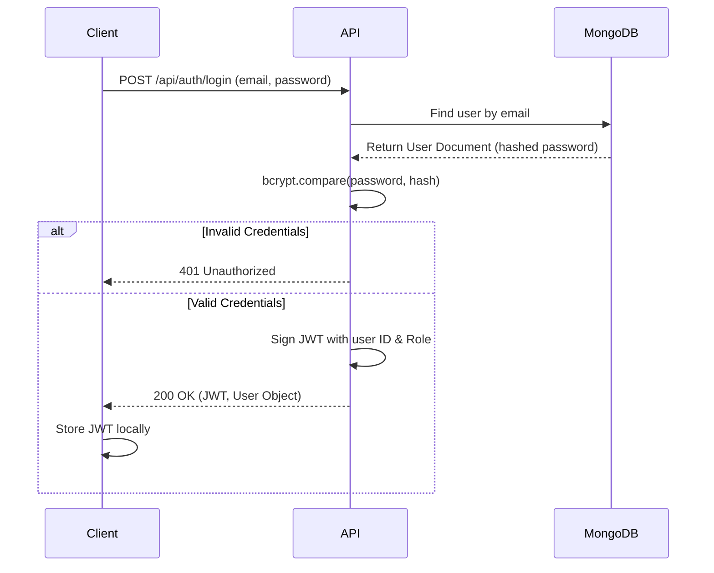
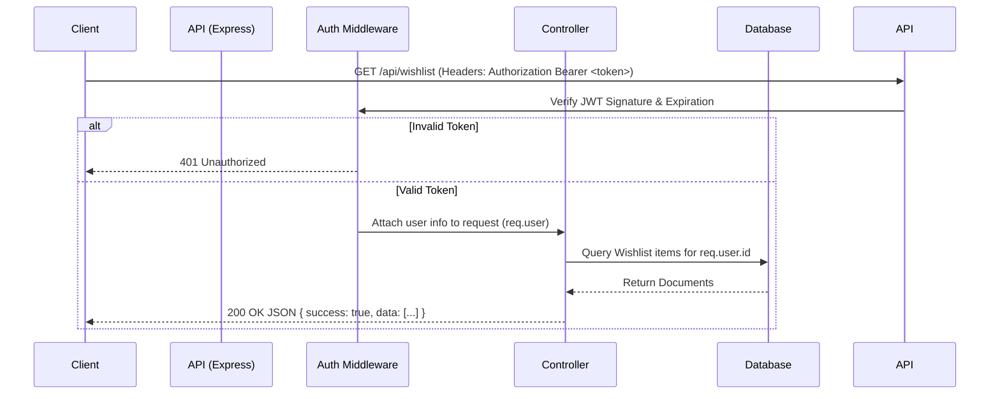

# System Architecture

## Overview
RentMate follows a standard, decoupled three-tier client-server architecture. This design separates concerns between the user interface, the business logic layer, and the data persistence layer. External third-party services are integrated exclusively through the backend API tier to ensure security and prevent exposing credentials to the client.

## High-Level Architecture

The system consists of the following primary tiers:

1.  **Client Tier (Frontend):** A Single Page Application (SPA) providing the user interface. It communicates with the backend exclusively via RESTful HTTP requests.
2.  **API Tier (Backend):** A Node.js and Express.js REST API that handles routing, authentication, authorization, business logic, data validation, and acts as an intermediary for external third-party services.
3.  **Data Tier (Database):** A NoSQL database (MongoDB) responsible for persisting application state, including user profiles, property listings, matching scores, expenses, and reviews.

## Component Architecture

### Frontend (Client Tier)
- **Framework:** React 19 (via Vite).
- **Styling:** Tailwind CSS v4 for utility-first styling. 
- **Routing:** React Router v7 for client-side navigation.
- **State Management:** React Context API for global state (e.g., AuthContext).
- **Network Requests:** Axios with interceptors for attaching JWT access tokens.

### Backend (API Tier)
- **Runtime:** Node.js 18+.
- **Framework:** Express.js 5.
- **Security Middleware:** Helmet for secure HTTP headers, CORS, and bcryptjs for password hashing.
- **Authentication:** Stateless JSON Web Tokens (JWT) for session management.
- **File Uploads:** Multer with memory storage. Streams directly to Cloudinary to bypass ephemeral local disk writes.
- **AI Integration:** `@google/generative-ai` SDK for server-side evaluation of roommate compatibility scores.

### Database (Data Tier)
- **Database:** MongoDB hosted on MongoDB Atlas (M0 free cluster).
- **ODM:** Mongoose for schema definition, model validation, and querying.
- **Indexes:** Utilizes indexes on highly queried fields like `city`, `nearestCollege`, `rent`, and `isVerified` to meet the <2s search latency requirement.

## External Services & Integrations

The system leverages the following third-party integrations, carefully orchestrated to prevent client-side credential exposure:

1.  **Google Gemini 2.0 Flash:** 
    - Used exclusively for generating roommate compatibility scores. 
    - **Data Flow:** The backend securely sends student preference JSON payloads to the Gemini API, parses the response, and caches the scores in MongoDB to minimize API calls and latency. A deterministic rule-based fallback exists if the API fails.
2.  **Cloudinary:** 
    - Used for scalable property and profile image storage. 
    - **Data Flow:** Client sends multipart/form-data to the backend. The backend processes the file into memory (using Multer) and streams it directly to Cloudinary, receiving a URL which is then stored in MongoDB.
3.  **Google Maps Embed API:** 
    - Static iframe embedding on property detail pages for interactive neighborhood context without requiring complex map SDKs on the client.

## Core Workflows

### Authentication Flow

### Typical Data Request Flow

## Infrastructure and Deployment Setup

For the MVP phase, the application is designed to deploy on modern, lightweight PaaS providers:
- **Frontend Deployment:** Vercel (Auto-deployments from GitHub).
- **Backend Deployment:** Render Free Web Service (Expects cold-start delays; uses stateless file handling).
- **Database Deployment:** MongoDB Atlas (M0 Shared Cluster).
- **Image Storage:** Cloudinary Free Tier.

## Future Architecture Considerations (Not Implemented)
- **Real-time Engine:** Currently, notifications rely on database polling. A future iteration will introduce WebSockets (e.g., Socket.io) for real-time push notifications and chat.
- **Payment Gateway:** Future integration with a payment provider (like Razorpay or Stripe) for rent and security deposit collection.
