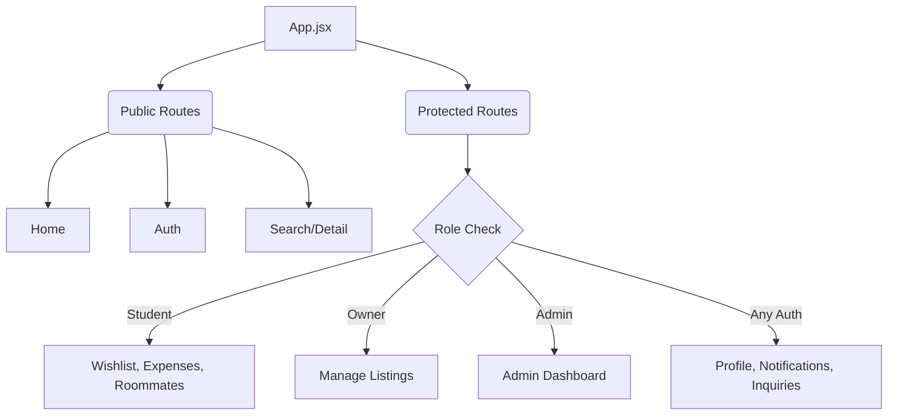
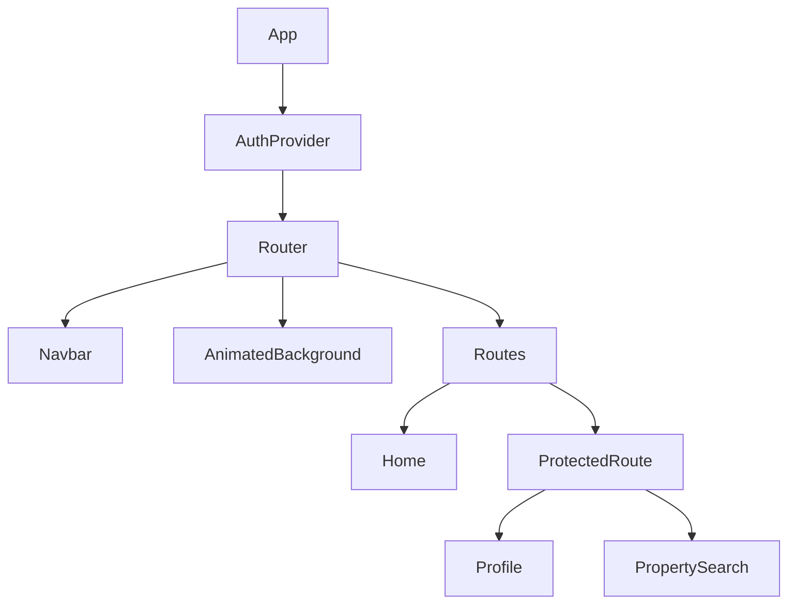
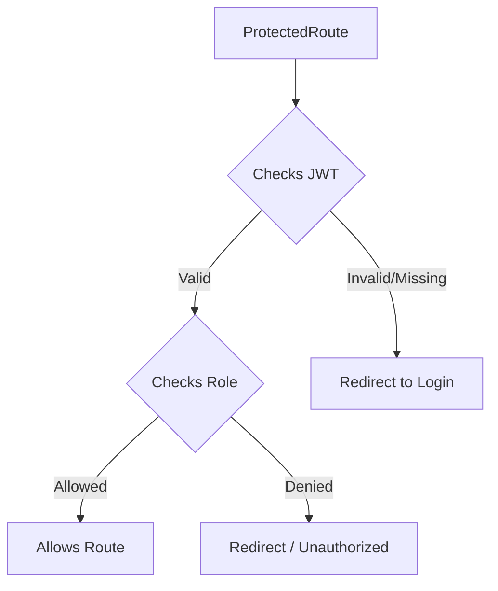

# Frontend Architecture

## Overview
The RentMate frontend is built as a Single Page Application (SPA) using React 19 and Vite. It serves as the primary interface for students, property owners, and administrators, providing a fast, responsive, and intuitive user experience. Vite provides extremely fast Hot Module Replacement (HMR) during development and optimized production builds through Rollup.

## Frontend Folder Structure
The `frontend/src/` directory is organized by feature and technical responsibility:

```text
src/
├── api/              # Axios configuration, interceptors, and API wrappers
├── assets/           # Static assets like icons, logos, and placeholder images
├── components/       # Reusable UI components (Navbar, ProtectedRoute, etc.)
├── context/          # React Context providers (AuthContext)
├── pages/            # View-level components mapped to routes
├── App.jsx           # Main routing configuration
├── index.css         # Global Tailwind CSS and base styles
└── main.jsx          # Application entry point and DOM mounting
```

## Routing Architecture
Routing is managed by `react-router-dom` (v7). The application uses a declarative routing structure in `App.jsx`, wrapping the entire application in the `AuthProvider` to ensure authentication state is accessible globally.

### Page Hierarchy
- **Public Routes:**
  - `/` -> Home
  - `/login` -> Login
  - `/register` -> Register
  - `/properties` -> PropertySearch
  - `/properties/:id` -> PropertyDetail
- **Protected Routes (Student):**
  - `/roommates` -> Roommates
  - `/expenses` -> Expenses
  - `/wishlist` -> Wishlist
- **Protected Routes (Owner):**
  - `/manage-listings` -> ManageListings
  - `/properties/new` -> ListingForm
  - `/properties/:id/edit` -> ListingForm
- **Protected Routes (Admin):**
  - `/admin` -> AdminDashboard
- **Protected Routes (General / Authenticated):**
  - `/profile` -> Profile
  - `/notifications` -> Notifications
  - `/inquiries` -> Inquiries

### Routing Diagram


## Component Organization
Components are split into two main categories:
1.  **Page Components (`src/pages/`):** Smart components that manage view-level state, handle side effects (data fetching), and render a composition of smaller UI components.
2.  **UI Components (`src/components/`):** Reusable, largely presentation-focused components. Notable examples include:
    -   `Navbar`: Responsive navigation bar handling user sessions.
    -   `ProtectedRoute`: A higher-order component pattern that guards routes based on authentication status and specific `allowedRoles`.
    -   `AnimatedBackground`: Global layout styling component.

### Component Hierarchy Diagram


## State Management (Context API)
For the MVP, global state management is intentionally kept lightweight, utilizing React's built-in Context API.
- **`AuthContext`:** Centralizes authentication state. It exposes `user`, `login`, `logout`, and `loading` properties. It automatically checks `localStorage` on initial mount to restore the user session.

## Authentication Flow on the Client
1.  User submits credentials via the Login form.
2.  The `/api/auth/login` endpoint is called.
3.  On success, the backend returns a JWT and user object.
4.  The JWT is stored in `localStorage` and the `AuthContext` is updated with the user's role and details.
5.  `Axios` interceptors automatically append `Authorization: Bearer <token>` to all subsequent requests.

Authentication is enforced using a `ProtectedRoute` wrapper.



## API Communication Layer
The `src/api/` folder contains the Axios configuration. 
- **Interceptors:** Axios interceptors are configured to attach the JWT from `localStorage` to the headers of outgoing requests.
- **Error Handling:** Centralized response interceptors catch `401 Unauthorized` responses and trigger a global logout flow if the token expires.

## Design Philosophy & UI Principles
The frontend emphasizes reusable components to reduce duplication and improve maintainability. Shared UI elements such as navigation, protected routing, and form controls are designed once and reused across multiple pages.

- **No Gradients:** The design strictly adheres to a flat color palette with tonal variations. Linear and radial gradients are explicitly avoided to maintain a professional, clean aesthetic.
- **Clean Layouts & Animations:** The UI emphasizes clean layouts, subtle transitions, and utility-first styling with Tailwind CSS. Animation support can be extended using libraries such as Framer Motion in future iterations.
- **Tailwind CSS v4:** Utility classes handle typography, spacing, and layout directly in JSX.

## Responsive Design Approach
The platform employs a **Mobile-First Approach**:
- Default Tailwind classes target mobile screens (e.g., stacked layouts, hamburger menus).
- `md:` and `lg:` breakpoints are used to progressively enhance the UI for tablets and desktops (e.g., grid layouts, visible navigation links).

## Performance Considerations
- **Code Splitting (Future Work):** While currently bundled together by Vite, route-level code splitting using `React.lazy` is an easy future optimization.
- **Polling Optimization:** Notifications are polled via `setInterval`. This is cleared on unmount (`useEffect` cleanup) to prevent memory leaks and unnecessary network overhead when the component is inactive.
- **Image Optimization:** All properties and profile avatars are served via Cloudinary, which automatically optimizes formats (e.g., returning WebP to modern browsers).

## Future Frontend Improvements
*These features are explicitly defined as **Future Work**:*
- Implementation of Redux or Zustand if global state complexity increases.
- Integration of a dedicated WebSocket client library (like Socket.io-client) to replace HTTP polling for real-time notifications.
- PWA (Progressive Web App) configuration for offline caching and "install to home screen" capability on mobile devices.
