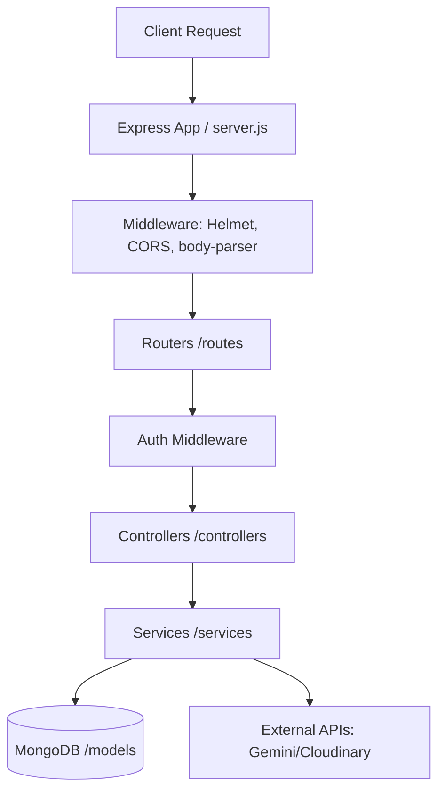

# Backend Architecture

## Overview
The RentMate backend is built with Node.js and Express.js, providing a robust, stateless RESTful API. It handles authentication, data validation, business logic, and communication with external services such as MongoDB, Cloudinary, and Google Gemini.

## Architectural Pattern
The backend follows a modular, controller-service-route pattern to separate concerns and improve maintainability:



## Directory Structure
```text
backend/src/
├── config/       # Database connection and environment config
├── controllers/  # Request/response handling logic
├── middleware/   # Custom middlewares (auth, validation)
├── models/       # Mongoose schemas
├── routes/       # API route definitions
└── services/     # Third-party service integrations
```

## Core Components
- **Express App:** Configured in `server.js` with global middlewares.
- **Controllers:** Map directly to API endpoints. They extract request data, call models or services, and return standard JSON responses.
- **Middleware:** 
  - `authenticate`: Verifies JWT tokens and attaches `req.user`.
  - `authorize`: Validates user roles (`student`, `owner`, `admin`).
- **Services:** Abstract complex logic, specifically `gemini.js` for AI scoring and `cloudinary.js` for image uploads via Multer memory streams.

## Future Work
- **Real-time Infrastructure:** Implementation of WebSocket servers (e.g., Socket.io) for real-time chat and push notifications.
- **Microservices:** Breaking out the AI matching engine into a separate microservice as the user base scales.
