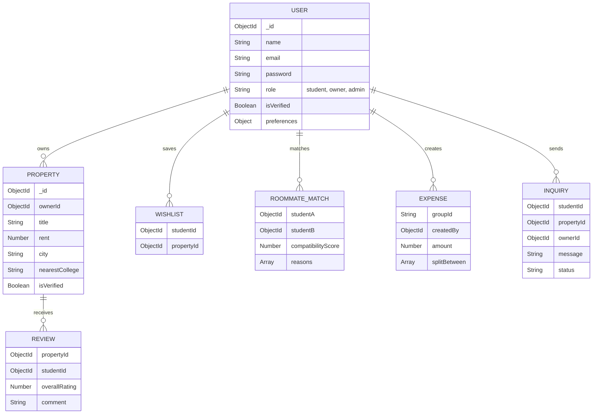

# Database Design

## Overview
RentMate utilizes MongoDB, a NoSQL document database, hosted on MongoDB Atlas (M0 free cluster). Mongoose is used as the Object Data Modeling (ODM) library to enforce schema validation and provide a structured querying interface.

## Entity Relationship Diagram

## Indexing Strategy
To meet performance requirements (<2s search latency), the following indexes are implemented:
- `User`: `email` (unique).
- `Property`: `city`, `nearestCollege`, `rent`, and `isVerified`.
- `Wishlist`: Compound unique index on `studentId` and `propertyId`.
- `RoommateMatch`: Compound unique index on `studentA` and `studentB` (normalized so A.id < B.id).

## MVP Limitations
- Expense groups do not have a dedicated `Group` collection; they rely on a shared string `groupId` across expense documents.

## Future Work
- **Relational Migrations:** If financial transactions (rent payments) become complex, a partial migration to PostgreSQL for ledger data might be required.
- **Geospatial Queries:** Implementing `2dsphere` indexes on property coordinates for "search within radius" features.
