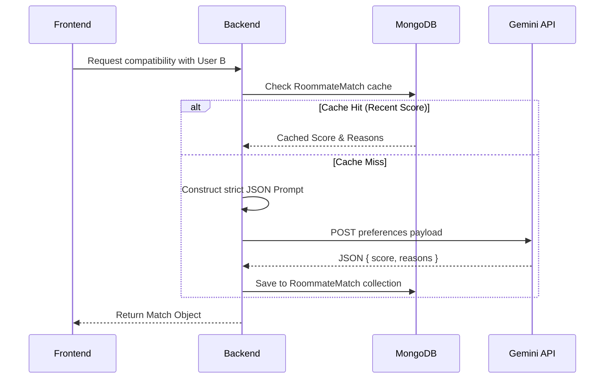

# AI Matching Engine

## Overview
The Roommate Matching feature utilizes Google Gemini 2.0 Flash to evaluate compatibility between two students based on their lifestyle preferences. This AI-driven approach provides nuanced reasoning rather than relying on basic boolean logic.

## Architecture & Data Flow

## The Prompt Structure
The backend constructs a secure prompt server-side, preventing prompt injection from the client. The prompt evaluates:
- Sleep Schedule
- Study Habits
- Food Preference
- Smoking Habits
- Cleanliness Level (1-5)
- Noise Tolerance (1-5)

Gemini is instructed to return a strict JSON payload containing a `compatibilityScore` (0-100) and an array of short `reasons`.

## Deterministic Fallback Algorithm
To ensure high availability, a rule-based fallback algorithm is implemented. If the Gemini API fails, times out, or returns unparseable JSON, the backend automatically computes a score using a deterministic point-deduction system (e.g., matching sleep schedules are rewarded; mismatched smoking habits incur a heavy penalty). This ensures the feature never breaks from the user's perspective.

## MVP Limitations
- The AI scoring is strictly 1-to-1. It does not evaluate group compatibility for three or more roommates.

## Future Work
- **Group Compatibility:** Expanding the prompt and data structures to evaluate dynamic household compatibility.
- **AI Property Recommendations:** Using historical search and wishlist data to suggest properties via an AI recommendation engine.
